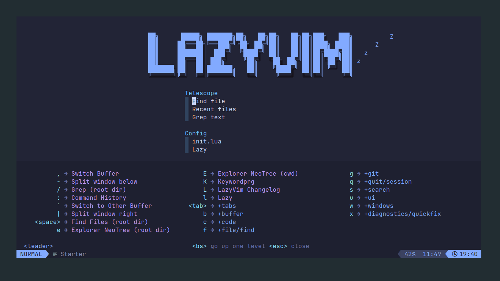

# Fanto_Neovim
My Neovim configuration (Portuguese Brazil)

# Installation

```shell 
sudo pacman -S neovim
```
- If gives an error line libc use the following commands:

``` shell
sudo pacman-key --init
```

``` shell
sudo pacman -S glibc lib32-glibc
```

# Install program LazyVim


# Commands

## Open the available Commands

- Use <kbd>Space</kbd> to show all available commands on LazyVim



## Open NeoTree

- Neotree is a plugin to show the folders from the current folder you open neovim.
- To activate click on <kbd>Space</kbd> + <kbd>E</kbd> to open neotree.
- Select a folder and click <kbd>Enter</kbd> to open the folder.
- If you click <kbd>Enter</kbd> into a file, it's going to open in neovim. 


